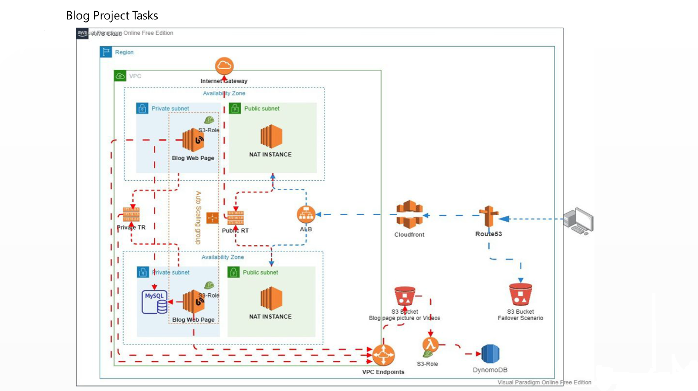

<<<<<<< HEAD



# 🌐 AWS Blog Web Page Infrastructure 🚀
=======
>>>>>>> fadb154 (update Project files)


# 🚀 BlogDjango

## 📘 Description

This project aims to deploy a blog application written with the Django Framework on AWS Cloud Infrastructure. The architecture includes an Application Load Balancer with an Auto Scaling Group of EC2 Instances and a Relational Database Service (RDS) within a defined VPC. 🌐 CloudFront and Route 53 services are positioned in front of the architecture to securely manage traffic. Users can upload pictures and videos to their blog pages, which are stored in an S3 Bucket. 🗂️

---

## ❓ Problem Statement

- 🏗️ A blog application has been developed to be hosted within an isolated VPC environment. Once the application is completed, it needs to be deployed to a production-grade AWS infrastructure.
- 📂 The application allows users to create blog posts. User data is stored in an RDS (MySQL) database, while media files are uploaded to S3 and tracked using DynamoDB.
- 🌍 The web application must be securely accessible via browser.
- 🔁 The project files are pushed to GitHub and pulled into AWS instances for deployment.

---

## 🛠️ Project Tasks

### ⚙️ Infrastructure Setup

1. **🌐 Create VPC and All Components**
   - Create VPC
   - Create Subnets
   - Attach Internet Gateway
   - Set Route Tables
   - Create Endpoint

2. **🔐 Configure Security Groups (ALB → EC2 → RDS)**
   - ALB Security Group
   - EC2 Security Group
   - RDS Security Group
   - NAT Instance Security Group

3. **🗄️ Set Up RDS**
   - Subnet Group for VPC
   - MySQL database (v8.0.35)

4. **🪣 Set Up Two S3 Buckets**
   - One for static website
   - One for media upload

### 🚀 Application Deployment

5. 📥 Clone or download application files from the repository  
6. 🧑‍💻 Set up your own GitHub repository  
7. 📋 Create User Data for the Launch Template  
8. 🔗 Add RDS endpoint and S3 bucket name to Django settings, push to GitHub  
9. 🚪 Launch NAT Instance in public subnet  
10. 🛠️ Create Launch Template and IAM Role  
11. 🔒 Create SSL Certificate  
12. 🎯 Create ALB and Target Group  
13. 🔄 Create Auto Scaling Group  
14. 🌐 Set up CloudFront in front of ALB  
15. 🧭 Configure Route 53 with failover settings  
16. 🧾 Create DynamoDB Table  
17. 🧠 Create Lambda Function  
18. ⚡ Configure S3 Event trigger for Lambda  

---

## 🖥️ Server Specifications

- **Operating System**: Ubuntu Server 22.04

---

## 🗂️ Project Folder Structure

```text
BlogDjango/
├── src/                  # Django application code
├── requirements.txt      # Python dependencies
├── lambda_function.py    # AWS Lambda handler
└── developer_notes.txt   # Notes and credentials
```

---

## ✅ Result

This project demonstrates a complete AWS deployment of a Django-based blog application. It includes a secure, scalable infrastructure with S3 for media storage, RDS for relational data, and integrated services such as CloudFront, Route 53, Lambda, and DynamoDB for event-based logging and traffic handling.
